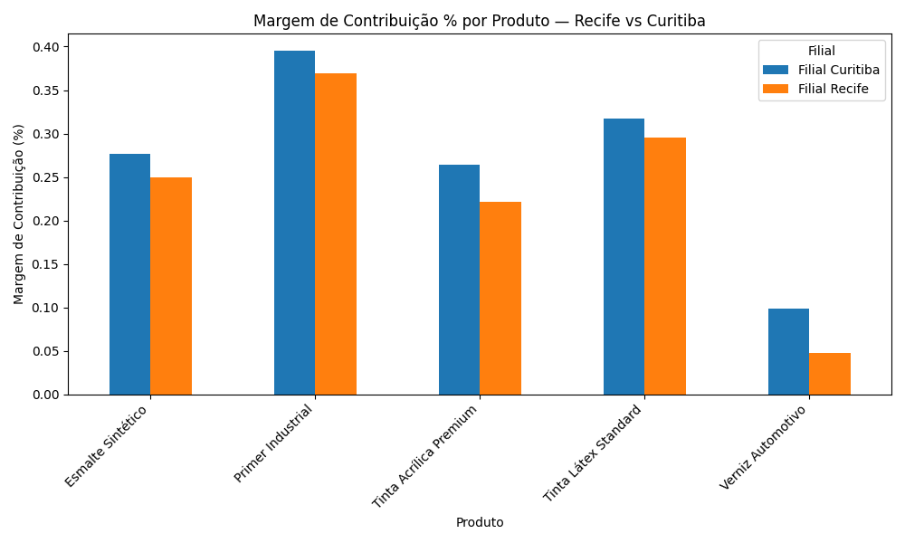

# Análise de Margem de Contribuição por Filial

Projeto de análise de dados aplicando conceitos reais de Controladoria/FP&A para identificar problemas de rentabilidade em uma rede de filiais.

## Contexto de negócio

Como Controller com experiência prática em análise de margem, um dos desafios mais comuns é identificar rapidamente **quais unidades de negócio estão consumindo caixa** — e, mais importante, **por quê**. Números de resultado consolidado escondem esse tipo de problema; a resposta só aparece quando você quebra os dados por filial e por produto.

Este projeto simula esse processo de ponta a ponta, com uma base de dados fictícia representando uma rede de 6 filiais vendendo 5 linhas de produtos ao longo de 12 meses.

## Pergunta de negócio

> Quais filiais estão com resultado líquido negativo, e isso é um problema generalizado ou concentrado em produtos específicos?

## Dados

- **Período:** 12 meses (jan a dez de 2025)
- **Granularidade:** filial × produto × mês (360 linhas)
- **Colunas principais:** receita, custo variável, custo fixo alocado, margem de contribuição, resultado líquido

*(Dataset fictício, gerado para fins de portfólio — não representa dados reais de nenhuma empresa.)*

## Metodologia

1. **Exploração inicial** — carregamento e inspeção da base com Python/Pandas (`describe()`, checagem de valores únicos)
2. **Agregação por filial** — cálculo de receita, margem de contribuição e resultado líquido totais no ano, por filial
3. **Investigação da causa raiz** — filtro das filiais com pior resultado e quebra por produto, para isolar se o problema é geral ou concentrado
4. **Visualização** — gráfico comparativo de margem % por produto, nas filiais problemáticas

## Principais achados

| Filial | Receita Total | Margem de Contribuição | Resultado Líquido | Margem % |
|---|---|---|---|---|
| Recife | R$ 666.571,94 | R$ 125.346,59 | **-R$ 426.653,41** | 18,8% |
| Curitiba | R$ 1.057.644,65 | R$ 240.486,43 | **-R$ 287.513,57** | 22,7% |
| BH | R$ 1.494.715,90 | R$ 429.863,83 | -R$ 194.136,17 | 28,8% |
| POA | R$ 1.404.789,02 | R$ 436.927,29 | -R$ 139.072,71 | 31,1% |
| RJ | R$ 2.381.302,69 | R$ 802.206,68 | R$ 106.206,68 | 33,7% |
| SP | R$ 3.989.314,61 | R$ 1.489.540,38 | R$ 709.540,38 | 37,3% |

**Recife e Curitiba são as duas filiais com pior desempenho**, ambas com resultado líquido negativo relevante e margem percentual abaixo da média da rede.

Ao quebrar por produto dentro dessas duas filiais, o problema não é generalizado — está **concentrado na linha Verniz Automotivo**:

- Recife: margem de apenas **4,7%** em Verniz Automotivo (vs. 22–37% nos demais produtos da mesma filial)
- Curitiba: margem de **9,8%** no mesmo produto (vs. 26–40% nos demais)



## Recomendação

O resultado negativo em Recife e Curitiba não decorre de operação ineficiente na filial como um todo, mas de uma **estrutura de custo/preço desalinhada especificamente na linha Verniz Automotivo** nessas praças. Recomenda-se:
- Revisar a política de precificação do Verniz Automotivo nessas duas regiões
- Avaliar se o custo variável mais alto reflete frete, logística ou fornecedor local diferente
- Considerar descontinuar ou reposicionar a linha nessas filiais caso o reajuste de preço não seja viável comercialmente

## Ferramentas utilizadas

- Python (Pandas para manipulação de dados, Matplotlib para visualização)

## Como reproduzir

```bash
pip install pandas matplotlib
python analise.py
```

---

*Projeto desenvolvido como parte de transição de carreira de Controladoria/FP&A para Análise de Dados.*
